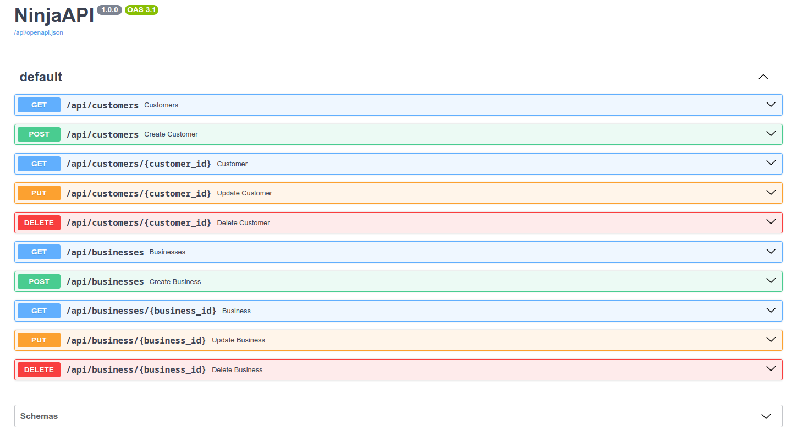

# Jambo App

## Table Of Contents

- [Jambo App](#jambo-app)
  - [Table Of Contents](#table-of-contents)
  - [Introduction](#introduction)
  - [Local Server Setup](#local-server-setup)
    - [Clone The Repository](#clone-the-repository)
    - [Install Dependencies](#install-dependencies)
    - [Run the Server](#run-the-server)
  - [**EndPoints**](#endpoints)
  - [**DATABASE DESIGN DIAGRAM**](#database-design-diagram)
  - [Limitations and Assumptions](#limitations-and-assumptions)
  - [Authors](#authors)
  - [License](#license)

## Introduction

Welcome to the Jambo App! This document provides detailed information on setting up the server locally, API endpoints, Limitations and Assumptions.

Django Ninja was used as it is more efficient and faster than Plain Django, Django REST-framework and Flask as shown by this [benchmark](https://github.com/vitalik/django-ninja-benchmarks) results.

---

## Local Server Setup

### Clone The Repository

To get started with the local development environment, clone the repository:

```bash
$ git clone git@github.com:mashm3ll0w/jambotest.git
$ cd jambotest
```

### Install Dependencies

You can set up the environment using `venv` or `pipenv`. Here are instructions for both:

Using `venv`:

```bash
# create Virtual Environment
$ python3 -m venv venv

# Activate Virtual Env
$ source venv/bin/activate

# Switch to the ninja branch
$ git switch ninja

# Install Dependencies
$ pip install -r requirements.txt
```

Using `pipenv`:

```bash
$ pip install pipenv

# create virtuel environment
$ pipenv --python 3.10

# Activate virtual env
$ pipenv shell

# Switch to the ninja branch
$ git switch ninja

# install dependencies in requirements.txt or pipfile
$ pipenv install
```

### Run the Server

```bash
$ python3 manage.py runserver
```

## **EndPoints**

The documentation for the api can be found at `api/docs`
  

## **DATABASE DESIGN DIAGRAM**

  

## Limitations and Assumptions

- Used the bundled **SQLite** over a feature rich DB like **PostgreSQL**
- Plain django was used for the project in the [**main**](https://github.com/mashm3ll0w/jambotest/tree/main) branch

## Authors

- [@Charles Swaleh](https://github.com/mashm3ll0w)

## License

MIT License
