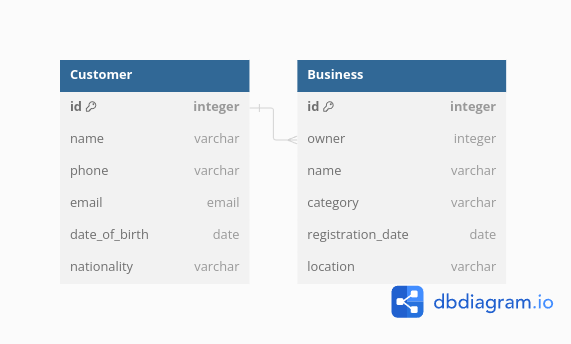

# Events App Team SpitFire

## Table Of Contents

- [Events App Team SpitFire](#events-app-team-spitfire)
  - [Table Of Contents](#table-of-contents)
  - [Introduction](#introduction)
  - [Local Server Setup](#local-server-setup)
    - [Clone The Repository](#clone-the-repository)
    - [Install Dependencies](#install-dependencies)
    - [Run the Server](#run-the-server)
  - [**EndPoints**](#endpoints)
    - [Customers Endpoint](#customers-endpoint)
    - [Businesses Endpoint](#businesses-endpoint)
  - [**DATABASE DESIGN DIAGRAM**](#database-design-diagram)
  - [Limitations and Assumptions](#limitations-and-assumptions)
  - [Authors](#authors)
  - [License](#license)

## Introduction

Welcome to the Jambo App! This document provides detailed information on setting up the server locally, API endpoints, Limitations and Assumpitions.

---

## Local Server Setup

### Clone The Repository

To get started with the local development environment, clone the repository:

```bash
$ git clone git@github.com:mashm3ll0w/jambotest.git
$ cd jambotest
```

### Install Dependencies

You can set up the environment using `venv` or `pipenv`. Here are instructions for both:

Using `venv`:

```bash
# create Virtual Environment
$ python3 -m venv venv

# Activate Virtual Env
$ source venv/bin/activate

# Switch to the ninja branch
$ git switch ninja

# Install Dependencies
$ pip install -r requirements.txt
```

Using `pipenv`:

```bash
$ pip install pipenv

# create virtuel environment
$ pipenv --python 3.10

# Activate virtual env
$ pipenv shell

# Switch to the ninja branch
$ git switch ninja

# install dependencies in requirements.txt or pipfile
$ pipenv install
```

### Run the Server

```bash
$ python3 manage.py runserver
```

## **EndPoints**

### Customers Endpoint

`GET 'api/customers/'`

- Retrieves all customers from the database
- Returns: JSON response with an array of customer objects containing `id`, `name`, `phone`, `email`, `date_of_birth` and `nationality`

Example Response

```json
{
  "customers": [
    {
      "id": 1,
      "name": "Arya Stark",
      "phone": "+XXXXXXXXXXXX",
      "email": "arya.stack@winterfell.com",
      "date_of_birth": "1710-01-23",
      "nationality": "Faceless"
    },
    {
      "id": 2,
      "name": "Jon Snow",
      "phone": "+XXXXXXXXXXXX",
      "email": "jon.snow@winterfell.com",
      "date_of_birth": "1700-01-23",
      "nationality": "Northerner"
    }
  ]
}
```

_status code: 200_

---

`GET 'api/customers/${id}'`

- Retrieves a customer from the database using customer id
- Path Parameter: `id`- integer ID of the customer to retrieve
- Returns: JSON response with customer object containing `id`, `name`, `phone`, `email`, `date_of_birth` and `nationality`

Example Response

```json
{
  "id": 3,
  "name": "John Snow",
  "phone": "+XXXXXXXXXXXX",
  "email": "jon.snow@winterfell.com",
  "date_of_birth": "1700-01-23",
  "nationality": "Northerner"
}
```

_status code: 200_

---

`POST 'api/customers/'`

- Creates a new customer object
- Returns: JSON response with the new customer object containing `id`, `name`, `phone`, `email`, `date_of_birth` and `nationality`

Example Response

```json
{
  "id": 5,
  "name": "Tyrion Lannister",
  "phone": "+XXXXXXXXXXXX",
  "email": "tyrion.lannister@kingslanding.com",
  "date_of_birth": "1880-05-23",
  "nationality": "Casterlian"
}
```

_status code: 201_

---

`DELETE 'api/customers/${id}'`

- Deletes a customer from the database using customer id
- Path Parameter: `id`- integer ID of the customer to delete
- Returns: JSON response with message:

Example Response

```json
{
  "message": "Customer deleted"
}
```

_status code: 204_

---

### Businesses Endpoint

`GET 'api/businesses/'`

- Retrieves all businesses from the database
- Returns: JSON response with an array of business objects containing `id`, `name`, `owner`, `category`, `registration_date`, `business_age` and `location_information`

Example Response

```json
{
  "businesses": [
    {
      "id": 1,
      "name": "Ghost Inc",
      "owner": "Jon Snow",
      "category": "Cybersecurity",
      "registration_date": "2020-04-27",
      "business_age": "4 Years 0 Months 0 Days",
      "location_information": "The North, The Wall, Castle Black, 120th Floor"
    },
    {
      "id": 3,
      "name": "Red Vines",
      "owner": "Tyrion Lannister",
      "category": "Winery",
      "registration_date": "2016-01-05",
      "business_age": "8 Years 3 Months 22 Days",
      "location_information": "Casterly Rock, Main House, 2nd Floor"
    }
  ]
}
```

_status code: 200_

---

`GET 'api/businesses/${id}'`

- Retrieves a business from the database using business id
- Path Parameter: `id`- integer ID of the business to retrieve
- Returns: JSON response with customer object containing `id`, `name`, `owner`, `category`, `registration_date`, `business_age` and `location_information`

Example Response

```json
{
    "id": 1,
    "owner": "Jon Snow",
    "name": "Ghost Inc",
    "category": "Cybersecurity",
    "registration_date": "2020-04-27",
    "business_age": "4 Years 0 Months 0 Days",
    "location_information": "Nairobi, Westlands, Victoria Plaza, 18th Floor",
}
```

_status code: 200_

---

`POST 'api/businesses/'`

- Creates a new business object
- Returns: JSON response with the new business object containing `id`, `name`, `owner`, `category`, `registration_date`, `business_age` and `location_information`

Example Response

```json
{
    "id": 6,
    "name": "Google",
    "owner": "Arya Stark",
    "category": "Technology",
    "registration_date": "2016-01-05",
    "business_age": "8 Years 3 Months 22 Days",
    "location_information": "Nairobi, Westlands, Victoria Plaza, 18th Floor",
}
```

_status code: 201_

---

`DELETE 'api/business/${id}'`

- Deletes a business from the database using business id
- Path Parameter: `id`- integer ID of the business to delete
- Returns: JSON response with message:

Example Response

```json
{
  "message": "Business deleted"
}
```

_status code: 204_

---

## **DATABASE DESIGN DIAGRAM**

  

## Limitations and Assumptions

- Used the bundled **SQLite** over a feature rich DB like **PostgreSQL**

## Authors

- [@Charles Swaleh](https://github.com/mashm3ll0w)

## License

MIT License
